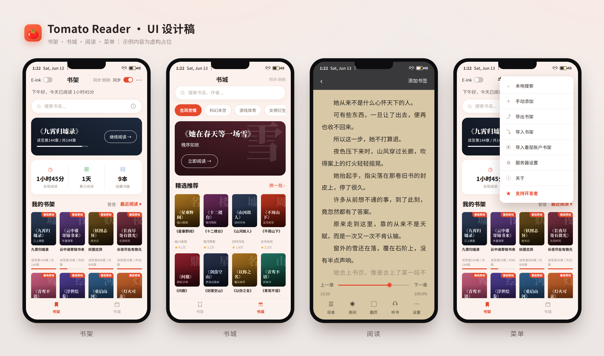

# 番茄阅读器

一款内置番茄小说搜索与自动更新功能的 Android 电子书阅读器。

## 功能特性

- **搜索番茄小说** — 在书架界面直接搜索中文小说
- **一键下载** — 搜索结果可自动下载完整 TXT 文件到本地书架
- **启动自动更新** — 每次打开 App 自动检查书架中番茄小说的新章节，也可手动点击刷新按钮
- **阅读进度显示** — 书架显示每本书当前章节与总章节数
- **最近阅读排序** — 书架按最近阅读时间降序排列
- **本地 TXT 阅读** — 流畅的 Canvas 翻页渲染，支持书签、目录、字体与背景自定义
- **混合书架** — 本地手动添加的 TXT 与番茄小说并排显示，仅番茄小说参与更新检测
- **书城** — 独立的发现标签页，展示番茄小说每日分类榜单；每个类型随机推荐最多 10 本，附封面与简介，点击可一键跳转搜索；各类型配有独立换一批按钮，每次打开 App 自动刷新
- **自定义服务器** — 无需重新编译，在 App 内（右上角菜单 → 服务器设置）即可覆盖内置的下载服务器地址/密码和书城数据源，方便分发未配置 `local.properties` 的 APK
- **WebDAV 同步** — 在服务器设置中配置 WebDAV 地址、用户名和密码，通过右上角菜单的「WebDAV同步」按钮手动触发；书架采用最后修改时间决定方向（含删除传播），阅读进度按书逐条合并取最新值，本周累计阅读时间跨设备取最大值；支持坚果云、Nextcloud 等标准 WebDAV 服务
- **阅读统计** — 书架顶部左侧显示本周累计阅读时间，右侧显示上次读到的书及章节进度；有阅读记录时才显示右侧卡片，无阅读记录时左侧独占全行
- **单手模式** — 在阅读菜单的翻页选项中可开启单手模式；开启后，点击屏幕左半区也会翻到下一页（与右半区行为相同），方便单手持机阅读；滑动手势方向不受影响；墨水屏模式下也可独立开关
- **墨水屏模式** — 专为电子墨水屏设备优化的阅读模式，关闭动画与渐变效果，采用纯黑白配色，减少残影并降低刷新频率对阅读的干扰；通过主界面左上角 **E-ink** 开关全局控制（书架、书城、阅读界面同步切换），阅读界面的背景和夜间模式在开启时自动锁定；翻页菜单在墨水屏模式下仍可打开，翻页动画选项被禁用，但单手模式开关保持可用。**强烈建议在墨水屏设备（如文石、Kindle、掌阅等）上安装时开启此模式**

Note:由于GitHub编译时间限制，本项目今后不再同步发布新的release apk文件。请下载项目后自行本地编译。
## 截图




## 下载

从 [Releases](../../releases) 页面获取最新 APK。

## 编译

环境要求：JDK 11+、Android SDK（命令行工具或 Android Studio）

```bash
git clone git@github.com:bidabrain/Tomato-Novel.git
cd Tomato-Novel
cp local.properties.example local.properties
# 编辑 local.properties，填入服务器地址和密码（详见下方「服务器配置」）
./gradlew assembleDebug
# APK 输出路径：app/build/outputs/apk/debug/
```

## 服务器配置

App 依赖自建的 [Tomato-Novel-Downloader](https://github.com/zhongbai2333/Tomato-Novel-Downloader) 实例进行搜索与下载。

服务器地址和密码**不存储在源码中**，需将 `local.properties.example` 复制为 `local.properties`（已加入 .gitignore）并填写：

```
# local.properties
sdk.dir=/path/to/android/sdk
DOWNLOADER_URL=https://your-downloader-server.example.com
DOWNLOADER_PASSWORD=your-password-here
```

编译时 Gradle 会将这些值注入 `BuildConfig`，打包进 APK 但不出现在源码中。

若 `local.properties` 不存在或字段为空，App 可正常编译，但搜索和下载功能需在 App 内手动配置服务器后才能使用（见下方「应用内服务器设置」）。

## 应用内服务器设置

无需重新编译，可在运行时配置服务器：

1. 打开 App → 点击右上角 **···** → **服务器设置**
2. 开启 **自定义搜索下载服务器**，填入服务器地址和访问密码
3. 开启 **自定义书城数据源**，填入 `latest_ranks.json` 的完整 URL
4. 点击 **保存** — 书城缓存自动清空，新数据源立即生效

开关关闭或输入框留空时，自动回退到编译时内置的地址。

## 下载服务器 API 说明

App 通过以下 REST API 与 [Tomato-Novel-Downloader](https://github.com/zhongbai2333/Tomato-Novel-Downloader) 服务器通信。所有请求需携带密码头：

```
x-tomato-password: <密码>
```

---

### 搜索书籍

```
GET /api/search?q=<关键词>
```

关键词需 URL 编码（如 `斗破苍穹` → `%E6%96%97%E7%A0%B4%E8%8B%8D%E7%A9%B9`）。

**响应示例：**

```json
{
  "items": [
    {
      "book_id": "7474273361892213273",
      "author": "铁匠小笑",
      "raw": {
        "book_name": "斗破苍穹——九星药尊者药尘",
        "abstract": "书籍简介...",
        "thumb_url": "https://...",
        "serial_count": "1",
        "word_number": "9489",
        "update_status": "0",
        "score": "0",
        "category": "同人"
      }
    }
  ]
}
```

App 从 `raw` 字段提取封面（`thumb_url`）、简介（`abstract`）、章节数（`serial_count`）、字数（`word_number`）、评分（`score`）、分类（`category`）。

---

### 创建下载任务

```
POST /api/jobs
Content-Type: application/json

{"book_id": "7474273361892213273"}
```

**响应：**

```json
{"id": 2, "book_id": "7474273361892213273", "state": "queued"}
```

服务器繁忙时返回 HTTP 429，需稍后重试。

---

### 查询任务状态

```
GET /api/jobs?id=<jobId>
```

**响应示例（运行中）：**

```json
{
  "done_retention_ms": 7200000,
  "items": [
    {
      "id": 2,
      "book_id": "7474273361892213273",
      "title": "斗破苍穹——九星药尊者药尘",
      "author": "铁匠小笑",
      "state": "running",
      "message": null,
      "format_options": null,
      "book_name_options": null,
      "progress": {
        "chapter_total": 1,
        "group_total": 1,
        "group_done": 0,
        "saved_chapters": 0,
        "save_phase": "TextSave",
        "comment_total": 0,
        "comment_fetch": 0,
        "comment_saved": 0
      },
      "created_ms": 1781112395555,
      "updated_ms": 1781112397674
    }
  ]
}
```

`state` 取值：`queued` → `running` → `done` / `failed`

- `format_options` 非 null 时，需调用下方接口选择格式
- `book_name_options` 非 null 时，需调用下方接口确认书名
- `message` 非 null 时表示失败原因

---

### 选择下载格式（按需）

当 `format_options` 非 null 时调用：

```
POST /api/jobs/<jobId>/format
Content-Type: application/json

{"value": "txt"}
```

---

### 确认书名（按需）

当 `book_name_options` 非 null 时调用：

```
POST /api/jobs/<jobId>/book_name
Content-Type: application/json

{"value": null}
```

`null` 表示使用服务器默认书名。

---

### 查询所有任务

```
GET /api/jobs
```

返回所有任务列表（包含已完成的，保留 `done_retention_ms` 毫秒）。

---

### 在 library 中查找文件

任务完成后，用书名在服务器文件库中定位 TXT 文件的相对路径：

```
GET /api/library?name=<书名>
```

**响应示例：**

```json
{
  "root": "/data",
  "path": "",
  "running": false,
  "scanned": 12,
  "error": null,
  "items": [
    {"kind": "file", "ext": "txt", "rel_path": "斗破苍穹——九星药尊者药尘.txt"}
  ]
}
```

`running: true` 表示扫描尚未完成，需轮询等待。若结果为目录（`kind: "dir"`），可追加 `&path=<rel_path>` 递归查询子目录。

---

### 下载文件

```
GET /download/<rel_path>
```

`rel_path` 中的空格需编码为 `%20`。返回文件字节流（UTF-8 文本）。

**示例：**

```
GET /download/%E6%96%97%E7%A0%B4%E8%8B%8D%E7%A9%B9%E2%80%94%E2%80%94%E4%B9%9D%E6%98%9F%E8%8D%AF%E5%B0%8A%E8%80%85%E8%8D%AF%E5%B0%98.txt
```

---

### 完整下载流程

```
1. POST /api/jobs {"book_id": "xxx"}         → 获得 jobId
2. 轮询 GET /api/jobs?id=<jobId>
   - 若 format_options 非 null → POST /api/jobs/<id>/format {"value":"txt"}
   - 若 book_name_options 非 null → POST /api/jobs/<id>/book_name {"value":null}
   - 等待 state == "done"
3. GET /api/library?name=<书名>              → 获得 rel_path（轮询至 running:false）
4. GET /download/<rel_path>                  → 下载 TXT 文件
```

## 致谢

| 项目 | 用途 |
|---|---|
| [gedoor/legado](https://github.com/gedoor/legado) | 整体阅读体验的灵感来源 |
| [yanjunhui2014/ebook_reader](https://github.com/yanjunhui2014/ebook_reader) | 基于 Canvas 的 TXT 翻页引擎（PageFactory / PageWidget） |
| [zhongbai2333/Tomato-Novel-Downloader](https://github.com/zhongbai2333/Tomato-Novel-Downloader) | 番茄小说 API 接入与代理策略参考 |
| [bumptech/glide](https://github.com/bumptech/glide) | 封面图片加载 |
| [square/okhttp](https://github.com/square/okhttp) | HTTP 网络请求 |
| [google/gson](https://github.com/google/gson) | JSON 解析 |
| [androidx Room](https://developer.android.com/jetpack/androidx/releases/room) | 本地数据库 |
| [wen1701/FanqieRankTracker](https://github.com/wen1701/FanqieRankTracker) | 书城每日番茄小说分类榜单数据 |
| [rany2/edge-tts](https://github.com/rany2/edge-tts) | Edge TTS WebSocket 协议实现参考（Sec-MS-GEC 鉴权算法） |

## 许可

本项目仅供个人非商业用途。请遵守番茄小说 / 字节跳动的服务条款。


## Star History

<a href="https://www.star-history.com/#bidabrain/Tomato-Novel&Date">
 <picture>
   <source media="(prefers-color-scheme: dark)" srcset="https://api.star-history.com/svg?repos=bidabrain/Tomato-Novel&type=Date&theme=dark" />
   <source media="(prefers-color-scheme: light)" srcset="https://api.star-history.com/svg?repos=bidabrain/Tomato-Novel&type=Date" />
   
 </picture>
</a>
